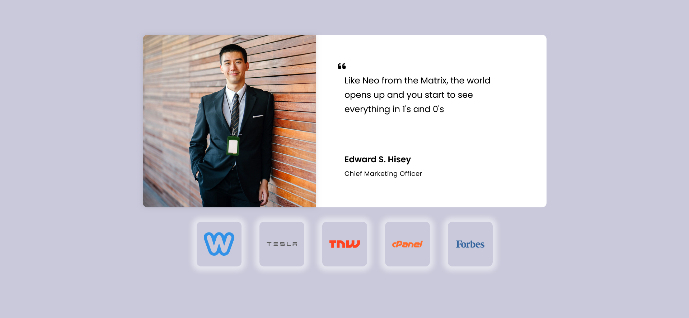

# Testimonials-2 Page /ICodeThis Challenge

This is a solution to a challenge "Subscription Plan" from the website [ICodeThis](https://icodethis.com/modes/design-to-code/467/submissions).

## Table of contents
[Task](#task)
[Screenshot](#screenshot)
[Links](#links)
[How it works](#how-it-works)
[Built with](#built-with)
[Author](#author)

## Task

Transform a provided design into a fully responsive testimonials page using HTML and CSS. The design should feature a section displaying a testimonial from a professional, complete with their name and title. 
Below the testimonial, include a row of logos from various companies. Ensure that the layout is adaptable to different screen sizes and include hover effects for the logos. Add smooth transitions and ensure the design is modern and clean.

## Screenshot

## Links

[Testimonials-2 Page](https://axinitm.github.io/Testimonials-2-Page-ICodeThis-Challenge/)

## How it works

The page features a testimonial section with a quote, name, and title of the professional.
Below the testimonial, there is a row of logos from various companies.
The design includes smooth hover effects on the logos and ensures the layout adapts to both desktop and mobile screen sizes.
The page is fully responsive, and logos adjust to fit different screen sizes.

## Built with

- Semantic HTML5
- Modern CSS3 (Flexbox, Media Queries)
- Fully responsive design

## Author

- Website - [Andrei Martinenko](https://www.frontender.biz)
- Github - [@AxinitM](https://github.com/AxinitM)
- ICodeThis - [Axinit](https://icodethis.com/Axinit)
